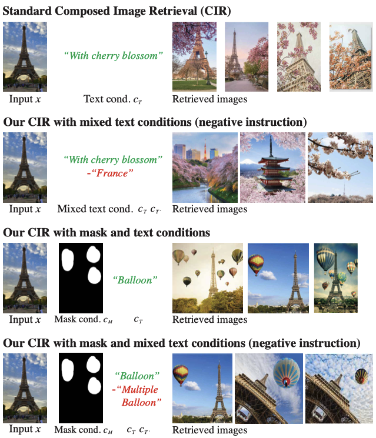
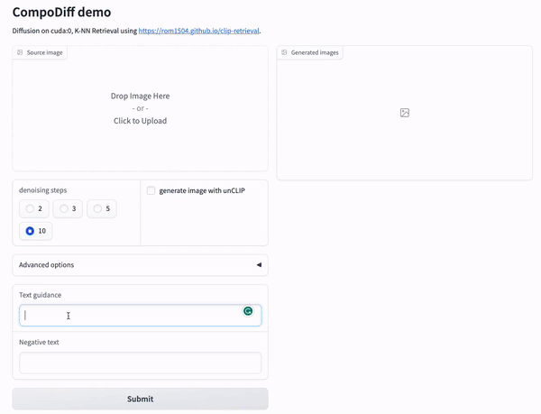
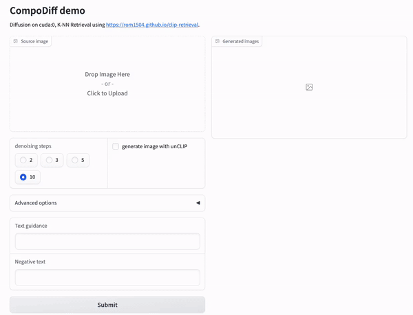
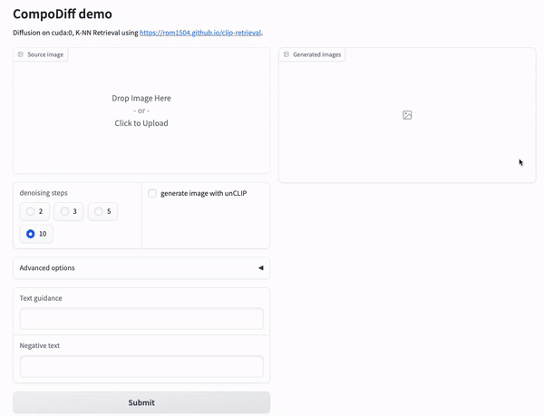

# CompoDiff: Versatile Composed Image Retrieval With Latent Diffusion



Official Pytorch implementation of CompoDiff

[\[Paper\]](https://arxiv.org/abs/2303.11916) [\[Demo🤗\]](https://huggingface.co/spaces/navervision/CompoDiff-Aesthetic)

**[Geonmo Gu](https://geonm.github.io/)\*<sup>1</sup>, [Sanghyuk Chun](https://sanghyukchun.github.io/home/)\*<sup>2</sup>, [Wonjae Kim](https://wonjae.kim)<sup>2</sup>, HeeJae Jun<sup>1</sup>, Yoohoon Kang<sup>1</sup>, [Sangdoo Yun](https://sangdooyun.github.io)<sup>2</sup>**

<sup>1</sup> NAVER Vision <sup>2</sup> NAVER AI Lab

\* First two authors contributed equally.

## ⭐ Overview

CompoDiff is a model that utilizes diffusion models for Composed Image Retrieval (CIR) for the first time.

The use of diffusion models has enabled the introduction of negative text and inpainting into CIR for the first time.

Moreover, since it operates based on the image feature space of the CLIP-L/14 model, it can be used with various text-to-image models (such as [Graphit](https://huggingface.co/navervision/Graphit-SD), [SD-unCLIP](https://huggingface.co/stabilityai/stable-diffusion-2-1-unclip), and [unCLIP (Karlo)](https://huggingface.co/kakaobrain/karlo-v1-alpha-image-variations)).

We overcame the challenge of collecting training data for CIR by generating a new SynthTriplets18M dataset. We are eager to release it soon and hope it will benefit the CIR research community.

We believe that CompoDiff has great potential to contribute to the advancement of CIR and look forward to seeing how it performs in the field.

## 🚀 NEWS

- 04/28/2023 - CompoDiff-Aesthetic released!

## 🖼️ CompoDiff-Aesthetic

In this repository, we first release CompoDiff-Aesthetic model, which is one of the variations of CompoDiff.

For text guidance, we used the textual embeddings of CLIP-G/14 trained by [open_clip](https://github.com/mlfoundations/open_clip), while the generated output feature is still the visual embeddings of CLIP-L/14.

We found that the textual embedding extractor of CLIP-G/14 not only performs better than those of CLIP-L/14 but also does not significantly increase computational cost.

CompoDiff-Aesthetic was trained on high-quality and high-resolution images, and we believe it has the potential to benefit not only CIR but also various generation models.

We hope that CompoDiff-Aesthetic will be a useful addition to the research community and look forward to seeing how it performs in various applications.

## 📚 SynthTriplets18M

Using text to image diffusion models, we have created a large-scale synthesized triplet dataset.

We are currently conducting some checks before releasing it publicly.

We plan to release SynthTriplets18M once we confirm that there are no social or ethical issues as soon as possible.

Please stay tuned. 😄

## Search and Image generation demo
We have set up a demo that can be tested in a local computing environment.

It can be executed with the following command:

```bash
$ git clone https://github.com/navervision/compodiff
$ cd compodiff
$ python demo_search.py
```

Demo will be hosted at https://0.0.0.0:8000

The unCLIP model used for image generation is from https://huggingface.co/kakaobrain/karlo-v1-alpha-image-variations.

### How to use demo
#### Usage 1. Project textual embeddings to visual embeddings


#### Usage 2. Composed visual embeddings without mask for CIR


#### Usage 3. Composed visual embeddings with mask for CIR


## 💡 Usage

### Install CompoDiff
```
$ pip install git+https://github.com/navervision/compodiff.git
```

### Build CompoDiff and CLIP models
```python
import compodiff
import torch
from PIL import Image
import requests

device = "cuda" if torch.cuda.is_available() else "cpu"

# build models
compodiff_model, clip_model, img_preprocess, tokenizer = compodiff.build_model()

compodiff_model, clip_model = compodiff_model.to(device), clip_model.to(device)

if device != 'cpu':
    clip_model = clip_model.half()
```

### Usage 1. Project textual embeddings to visual embeddings
```python
cfg_image_scale = 0.0
cfg_text_scale = 7.5

cfg_scale = (cfg_image_scale, cfg_text_scale)

input_text = "owl carved on the wooden wall"
negative_text = "low quality"

# tokenize the input_text first.
text_token_dict = tokenizer(text=input_text, return_tensors='pt', padding='max_length', truncation=True)
text_tokens, text_attention_mask = text_token_dict['input_ids'].to(device), text_token_dict['attention_mask'].to(device)

negative_text_token_dict = tokenizer(text=negative_text, return_tensors='pt', padding='max_length', truncation=True)
negative_text_tokens, negative_text_attention_mask = negative_text_token_dict['input_ids'].to(device), text_token_dict['attention_mask'].to(device)

with torch.no_grad():
    # In the case of Usage 1, we do not use an image cond and a mask at all.
    image_cond = torch.zeros([1,1,768]).to(device)
    mask = torch.zeros([64, 64]).to(device).unsqueeze(0)
    
    text_cond = clip_model.encode_texts(text_tokens, text_attention_mask)
    negative_text_cond = clip_model.encode_texts(negative_text_tokens, negative_text_attention_mask)
    
    # do denoising steps here
    timesteps = 10
    sampled_image_features = compodiff_model.sample(image_cond, text_cond, negative_text_cond, mask, timesteps=10, cond_scale=cfg_scale, num_samples_per_batch=2)
    # NOTE: "sampled_image_features" is not L2-normalized
```

### Usage 2. Composed visual embeddings without mask for CIR
```python
cfg_image_scale = 1.5
cfg_text_scale = 7.5

cfg_scale = (cfg_image_scale, cfg_text_scale)

input_text = "as pencil sketch"
negative_text = "low quality"

# tokenize the input_text first.
text_token_dict = tokenizer(text=input_text, return_tensors='pt', padding='max_length', truncation=True)
text_tokens, text_attention_mask = text_token_dict['input_ids'].to(device), text_token_dict['attention_mask'].to(device)

negative_text_token_dict = tokenizer(text=negative_text, return_tensors='pt', padding='max_length', truncation=True)
negative_text_tokens, negative_text_attention_mask = negative_text_token_dict['input_ids'].to(device), text_token_dict['attention_mask'].to(device)

# prepare a reference image
url = "http://images.cocodataset.org/val2017/000000039769.jpg"
image = Image.open(requests.get(url, stream=True).raw).resize((512, 512))

with torch.no_grad():
    processed_image = img_preprocess(image, return_tensors='pt')['pixel_values'].to(device)
    
    # In the case of Usage 2, we do not use a mask at all.
    mask = torch.zeros([64, 64]).to(device).unsqueeze(0)
    
    image_cond = clip_model.encode_images(processed_image)
    
    text_cond = clip_model.encode_texts(text_tokens, text_attention_mask)
    negative_text_cond = clip_model.encode_texts(negative_text_tokens, negative_text_attention_mask)
    
    timesteps = 10
    sampled_image_features = compodiff_model.sample(image_cond, text_cond, negative_text_cond, mask, timesteps=timesteps, cond_scale=cfg_scale, num_samples_per_batch=2)
    
    # NOTE: If you want to apply more of the original image’s context, increase the source weight in the Advanced options from 0.1. This will convey the context of the original image as a strong signal.
    source_weight = 0.1
    sampled_image_features = (1 - source_weight) * sampled_image_features + source_weight * image_cond[0]
```

### Usage 3. Composed visual embeddings with mask for CIR
```python
cfg_image_scale = 1.5
cfg_text_scale = 7.5

cfg_scale = (cfg_image_scale, cfg_text_scale)

input_text = "as pencil sketch"
negative_text = "low quality"

# tokenize the input_text first.
text_token_dict = tokenizer(text=input_text, return_tensors='pt', padding='max_length', truncation=True)
text_tokens, text_attention_mask = text_token_dict['input_ids'].to(device), text_token_dict['attention_mask'].to(device)

negative_text_token_dict = tokenizer(text=negative_text, return_tensors='pt', padding='max_length', truncation=True)
negative_text_tokens, negative_text_attention_mask = negative_text_token_dict['input_ids'].to(device), text_token_dict['attention_mask'].to(device)

# prepare a reference image
url = "http://images.cocodataset.org/val2017/000000039769.jpg"
image = Image.open(requests.get(url, stream=True).raw).resize((512, 512))

# prepare a mask image
url = "mask_url"
mask = Image.open(requests.get(url, stream=True).raw).resize((512, 512))

with torch.no_grad():
    processed_image = img_preprocess(image, return_tensors='pt')['pixel_values'].to(device)
    processed_mask = img_preprocess(mask, do_normalize=False, return_tensors='pt')['pixel_values'].to(device)
    processed_mask = processed_mask[:,:1,:,:]
    
    masked_processed_image = processed_image * (1 - (processed_mask > 0.5).float())
    mask = transforms.Resize([64, 64])(mask)[:,0,:,:]
    mask = (mask > 0.5).float()
    
    image_cond = clip_model.encode_images(masked_processed_image)
    
    text_cond = clip_model.encode_texts(text_tokens, text_attention_mask)
    negative_text_cond = clip_model.encode_texts(negative_text_tokens, negative_text_attention_mask)
    
    timesteps = 10
    sampled_image_features = compodiff_model.sample(image_cond, text_cond, negative_text_cond, mask, timesteps=timesteps, cond_scale=cfg_scale, num_samples_per_batch=2)
    
    # NOTE: If you want to apply more of the original image’s context, increase the source weight in the Advanced options from 0.1. This will convey the context of the original image as a strong signal.
    source_weight = 0.05
    sampled_image_features = (1 - source_weight) * sampled_image_features + source_weight * image_cond[0]
```

### Shotout
K-NN index for the retrieval results are entirely trained using the entire Laion-5B imageset. For this retrieval you do not need to download any images, this is made possible thanks to the great work of [rom1504](https://github.com/rom1504/clip-retrieval).

## Citing CompoDiff
If you find this repository useful, please consider giving a start ⭐ and citation:
```
@article{gu2023compodiff,
  title={CompoDiff: Versatile Composed Image Retrieval With Latent Diffusion},
  author={Gu, Geonmo and Chun, Sanghyuk and Kim, Wonjae and Jun, HeeJae and Kang, Yoohoon and Yun, Sangdoo},
  journal={arXiv preprint arXiv:2303.11916},
  year={2023}
}
```

## License
```
CompoDiff
Copyright 2023-present NAVER Corp.

Licensed under the Apache License, Version 2.0 (the "License");
you may not use this file except in compliance with the License.
You may obtain a copy of the License at

    http://www.apache.org/licenses/LICENSE-2.0

Unless required by applicable law or agreed to in writing, software
distributed under the License is distributed on an "AS IS" BASIS,
WITHOUT WARRANTIES OR CONDITIONS OF ANY KIND, either express or implied.
See the License for the specific language governing permissions and
limitations under the License.
```
